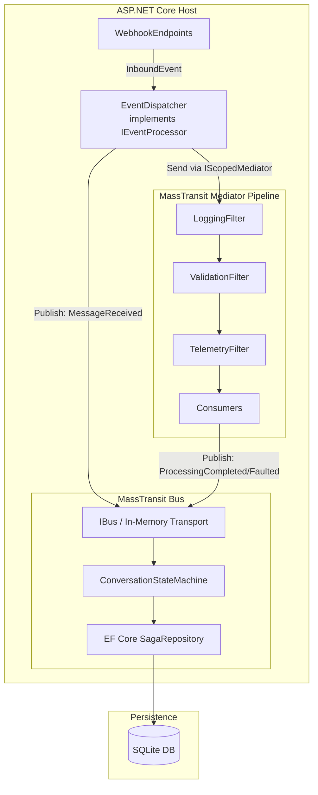

# Design Document: Unified MassTransit Pipeline

## Overview

This design unifies the RideClub Bot messaging infrastructure under a single framework — **MassTransit** — which serves both as the in-process mediator (replacing MediatR) and as the saga state machine host for conversation lifecycle tracking.

MassTransit's built-in mediator (`AddMediator` / `IScopedMediator`) provides:

- **Consumer-based command handling** — `IConsumer<T>` replaces MediatR's `IRequestHandler<T, TResponse>`
- **Publish/subscribe** — replaces MediatR's `INotification` / `INotificationHandler`
- **Middleware filters** — `IFilter<SendContext<T>>` replaces MediatR's `IPipelineBehavior<T, TResponse>`
- **Request/response** — `IRequestClient<T>` with `context.RespondAsync` replaces MediatR's request/response pattern

The `EventDispatcher` uses `IScopedMediator` for in-process command dispatch and `IBus` for publishing conversation events to the saga state machine. Pipeline filters provide cross-cutting logging, validation, and telemetry.

### Design Decisions

| Decision | Rationale |
| --- | --- |
| Replace MediatR with MassTransit Mediator | Eliminates a redundant dependency; MassTransit already provides mediator capabilities with consumers, filters, and sagas in one package |
| `AddMediator` + `AddMassTransit` (dual registration) | Mediator runs in-process without transport; Bus uses in-memory transport for saga state machine events — keeps concerns separated |
| `IScopedMediator` over `IMediator` | Shares the HTTP request scope with consumers, ensuring scoped dependencies (DbContext, etc.) are consistent |
| Commands as plain records (no marker interfaces) | Domain project has zero MassTransit dependency; commands are POCOs consumed via `IConsumer<T>` |
| Scoped send filters via `ConfigureMediator` | Filters apply globally to all mediator messages without per-consumer configuration |
| Unified `MassTransitModule` replaces `MediatorModule` + `SagaModule` | Single Autofac module for all MassTransit configuration; follows existing module composition pattern |
| MassTransit in-memory transport (dev) | Zero infrastructure for local development; production transport selectable via config |
| EF Core saga persistence in existing SQLite DB | Reuses existing persistence infrastructure; no new database required |

## Architecture



### Request Flow

1. `WebhookEndpoints.HandlePostAsync` calls `IEventProcessor.ProcessAsync(inboundEvent)`
2. `EventDispatcher` publishes a `MessageReceivedEvent` to MassTransit Bus as a fire-and-forget operation (state machine transitions to Processing independently of command dispatch success)
3. `EventDispatcher` maps `InboundEvent.Payload` to a command record and calls `IScopedMediator.Send`
4. Mediator pipeline filters execute in order: Logging → Validation → Telemetry → Consumer
5. Consumer processes the command, responds via `ConsumeContext.RespondAsync<MessageProcessingResult>`
6. `EventDispatcher` receives the response and publishes `ProcessingCompletedEvent` or `ProcessingFaultedEvent` to the Bus
7. State machine transitions based on the conversation event

## Components and Interfaces

### Unified MassTransit Module

#### MassTransitModule

Replaces both `MediatorModule` and `SagaModule`. Registered in `Program.cs` alongside existing modules. Responsibilities:

- Register MassTransit Mediator via `AddMediator` with consumer discovery
- Configure mediator pipeline filters (logging, validation, telemetry)
- Register `EventDispatcher` as `IEventProcessor`
- Delegate bus + saga configuration to `AddBotMassTransit` extension method

```csharp
internal sealed class MassTransitModule : Module
{
    protected override void Load(ContainerBuilder builder)
    {
        // Replace LoggingEventProcessor with EventDispatcher
        builder.RegisterType<EventDispatcher>()
            .As<IEventProcessor>()
            .InstancePerLifetimeScope();
    }
}
```

The mediator and bus registrations use `IServiceCollection` extension methods:

```csharp
internal static class MassTransitServiceCollectionExtensions
{
    public static IServiceCollection AddBotMediator(
        this IServiceCollection services)
    {
        services.AddMediator(cfg =>
        {
            // Register command consumers from Bot host assembly
            cfg.AddConsumer<ProcessTextMessageConsumer>();
            cfg.AddConsumer<ProcessBotCommandConsumer>();
            cfg.AddConsumer<UnrecognisedEventConsumer>();

            // Configure mediator pipeline filters (optional — when no filters
            // are registered for a request type, the mediator dispatches
            // directly to the consumer without requiring any filters to be present)
            cfg.ConfigureMediator((context, mcfg) =>
            {
                mcfg.UseSendFilter(typeof(LoggingFilter<>), context);
                mcfg.UseSendFilter(typeof(ValidationFilter<>), context);
                mcfg.UseSendFilter(typeof(TelemetryFilter<>), context);
            });
        });

        return services;
    }

    public static IServiceCollection AddBotMassTransit(
        this IServiceCollection services,
        IConfiguration configuration)
    {
        services.AddMassTransit(cfg =>
        {
            cfg.AddSagaStateMachine<ConversationStateMachine, ConversationSagaInstance>();

            cfg.SetEntityFrameworkSagaRepositoryProvider(r =>
            {
                r.ExistingDbContext<BotDbContext>();
            });

            cfg.UsingInMemory((context, inMemoryCfg) =>
            {
                inMemoryCfg.ConfigureEndpoints(context);
            });
        });

        return services;
    }
}
```

### EventDispatcher

The core integration component implementing `IEventProcessor`. Uses `IScopedMediator` for in-process command dispatch and `IBus` for publishing conversation events to the saga state machine.

```csharp
internal sealed class EventDispatcher : IEventProcessor
{
    private readonly IScopedMediator _mediator;
    private readonly IBus _bus;
    private readonly ILogger<EventDispatcher> _logger;

    public async Task ProcessAsync(InboundEvent inboundEvent, CancellationToken ct)
    {
        // 1. Publish MessageReceived to MassTransit Bus (fire-and-forget — independent of command dispatch success)
        await PublishMessageReceivedAsync(inboundEvent, ct);

        // 2. Map payload to command and send via mediator
        object? command = MapToCommand(inboundEvent);
        if (command is not null)
        {
            // Send command — mediator dispatches to consumer, exceptions propagate
            await _mediator.Send(command, ct);

            // 3. Publish outcome event to MassTransit Bus
            await PublishOutcomeAsync(inboundEvent, ct);
        }
        else
        {
            // Unknown payload type — publish notification via mediator
            await _mediator.Publish(
                new UnrecognisedEventNotification(inboundEvent), ct);
        }
    }

    private static object? MapToCommand(InboundEvent evt) => evt.Payload switch
    {
        TextMessagePayload txt => new ProcessTextMessageCommand { ... },
        CommandPayload cmd => new ProcessBotCommandCommand { ... },
        _ => null
    };
}
```

**Key difference from MediatR approach:** The mediator's `Send` method dispatches to a consumer that calls `context.RespondAsync<T>()`. The `EventDispatcher` uses `IRequestClient<T>` to get the response back, or alternatively sends fire-and-forget commands where the consumer publishes outcome events directly to the bus.

**Design choice:** Consumers publish outcome events (`ProcessingCompletedEvent` / `ProcessingFaultedEvent`) directly to `IBus` after processing, rather than returning a response through the mediator. This keeps the saga state machine decoupled from the mediator pipeline and allows the consumer to control exactly when and what gets published.

**Filter optionality:** Filters are registered globally but are not mandatory. If no filters are configured for a given request type, the mediator dispatches directly to the consumer. This means consumers can be tested in isolation without filter infrastructure, and new command types work immediately without requiring filter registration.

### Command Consumers

Consumers replace MediatR `IRequestHandler` implementations. Each consumer implements `IConsumer<T>` where `T` is the command record.

```csharp
internal sealed class ProcessTextMessageConsumer : IConsumer<ProcessTextMessageCommand>
{
    private readonly IBus _bus;

    public async Task Consume(ConsumeContext<ProcessTextMessageCommand> context)
    {
        var command = context.Message;

        // Process the text message (placeholder — future business logic)
        var result = new MessageProcessingResult { Success = true };

        // Publish outcome event to bus for saga state machine
        if (result.Success)
        {
            await _bus.Publish(new ProcessingCompletedEvent
            {
                Platform = command.Platform,
                SenderId = command.SenderId,
                RequiresConfirmation = false,
                ReplyMessage = result.ReplyMessage,
            }, context.CancellationToken);
        }
        else
        {
            await _bus.Publish(new ProcessingFaultedEvent
            {
                Platform = command.Platform,
                SenderId = command.SenderId,
                ErrorReason = result.ErrorReason ?? "Unknown error",
            }, context.CancellationToken);
        }
    }
}
```

### Notification Consumer

For unrecognised events, a notification consumer observes the event without returning a response:

```csharp
internal sealed class UnrecognisedEventConsumer : IConsumer<UnrecognisedEventNotification>
{
    private readonly ILogger<UnrecognisedEventConsumer> _logger;

    public Task Consume(ConsumeContext<UnrecognisedEventNotification> context)
    {
        _logger.LogWarning("Unrecognised event: {PayloadType}",
            context.Message.Event.Payload.GetType().Name);
        return Task.CompletedTask;
    }
}
```

### Pipeline Filters

Filters replace MediatR `IPipelineBehavior` implementations. They implement `IFilter<SendContext<T>>` and are registered via `ConfigureMediator`.

#### LoggingFilter

Wraps the entire pipeline. Logs command type + unique ID before execution, and type + ID + elapsed time after.

```csharp
internal sealed class LoggingFilter<T> : IFilter<SendContext<T>>
    where T : class
{
    private readonly ILogger<LoggingFilter<T>> _logger;

    public async Task Send(SendContext<T> context, IPipe<SendContext<T>> next)
    {
        var requestId = Guid.NewGuid().ToString("N")[..8];
        var typeName = typeof(T).Name;
        _logger.LogInformation("Handling {RequestType} [{RequestId}]",
            typeName, requestId);

        var sw = Stopwatch.StartNew();
        await next.Send(context);
        sw.Stop();

        _logger.LogInformation("Handled {RequestType} [{RequestId}] in {ElapsedMs}ms",
            typeName, requestId, sw.ElapsedMilliseconds);
    }

    public void Probe(ProbeContext context) =>
        context.CreateFilterScope("logging");
}
```

#### ValidationFilter

Resolves all `IValidator<T>` instances, runs validation, throws `ValidationException` on failure — preventing the consumer from being invoked.

```csharp
internal sealed class ValidationFilter<T> : IFilter<SendContext<T>>
    where T : class
{
    private readonly IEnumerable<IValidator<T>> _validators;

    public async Task Send(SendContext<T> context, IPipe<SendContext<T>> next)
    {
        if (_validators.Any())
        {
            var validationContext = new ValidationContext<T>(context.Message);
            var results = await Task.WhenAll(
                _validators.Select(v => v.ValidateAsync(validationContext)));
            var failures = results.SelectMany(r => r.Errors)
                .Where(f => f is not null).ToList();
            if (failures.Count > 0)
                throw new ValidationException(failures);
        }

        await next.Send(context);
    }

    public void Probe(ProbeContext context) =>
        context.CreateFilterScope("validation");
}
```

#### TelemetryFilter

Creates an OpenTelemetry activity span for each command, recording outcome.

```csharp
internal sealed class TelemetryFilter<T> : IFilter<SendContext<T>>
    where T : class
{
    private static readonly ActivitySource Source = new("RideClub.Bot.Mediator");

    public async Task Send(SendContext<T> context, IPipe<SendContext<T>> next)
    {
        using var activity = Source.StartActivity(typeof(T).Name);
        try
        {
            await next.Send(context);
            activity?.SetTag("mediator.outcome", "success");
        }
        catch (Exception ex)
        {
            activity?.SetTag("mediator.outcome", "exception");
            activity?.SetTag("mediator.exception_type", ex.GetType().Name);
            throw;
        }
    }

    public void Probe(ProbeContext context) =>
        context.CreateFilterScope("telemetry");
}
```

### Conversation State Machine

Unchanged from the current implementation — already MassTransit-native. The state machine consumes events published to the bus by the `EventDispatcher` and command consumers.

**Undefined transition handling:** If any event (not limited to `ConversationEvent` types) triggers a transition that is not defined for the current state, the state machine remains in its current state and logs a warning via the Serilog_Pipeline identifying the event type, source, current state, and correlation key.

**Startup logging:** The state machine logs invalid transition warnings via the Serilog_Pipeline even during startup. If the logging system is not yet available (e.g., during early host bootstrap), warnings are buffered or queued until Serilog is initialised. This is achieved by configuring Serilog early in the host builder pipeline (before MassTransit bus start) and using Serilog's `Log.Logger` static instance which buffers until sink configuration completes.

```csharp
public sealed class ConversationStateMachine
    : MassTransitStateMachine<ConversationSagaInstance>
{
    // States
    public State AwaitingInput { get; private set; } = null!;
    public State Processing { get; private set; } = null!;
    public State AwaitingConfirmation { get; private set; } = null!;
    public State Completed { get; private set; } = null!;
    public State Faulted { get; private set; } = null!;

    // Events
    public Event<MessageReceivedEvent> MessageReceived { get; private set; } = null!;
    public Event<ProcessingCompletedEvent> ProcessingCompleted { get; private set; } = null!;
    public Event<ProcessingFaultedEvent> ProcessingFaulted { get; private set; } = null!;
    public Event<ConversationTimedOutEvent> TimedOut { get; private set; } = null!;

    public ConversationStateMachine(ILogger<ConversationStateMachine> logger)
    {
        InstanceState(x => x.CurrentState);

        Event(() => MessageReceived, x => x.CorrelateBy(
            instance => instance.CorrelationKey,
            context => $"{context.Message.Platform}:{context.Message.SenderId}"));

        Initially(
            When(MessageReceived)
                .Then(ctx => { /* set instance fields */ })
                .TransitionTo(AwaitingInput));

        During(AwaitingInput,
            When(MessageReceived).TransitionTo(Processing),
            When(TimedOut).TransitionTo(Completed));

        During(Processing,
            When(ProcessingCompleted)
                .IfElse(ctx => ctx.Message.RequiresConfirmation,
                    then => then.TransitionTo(AwaitingConfirmation),
                    @else => @else.TransitionTo(AwaitingInput)),
            When(ProcessingFaulted).TransitionTo(Faulted));

        During(AwaitingConfirmation,
            When(MessageReceived).TransitionTo(Processing),
            When(TimedOut).TransitionTo(Completed));

        // Log warnings for any event that triggers an undefined transition,
        // regardless of event source (not limited to Conversation_Events).
        // Includes event type, source, current state, and correlation key.
        DuringAny(
            When(MessageReceived)
                .IfElse(ctx => /* transition is not defined */ false,
                    undefined => undefined.Then(ctx =>
                        logger.LogWarning(
                            "Undefined transition: Event={EventType} Source={Source} State={State} CorrelationKey={Key}",
                            nameof(MessageReceived),
                            ctx.Message.Platform,
                            ctx.Instance.CurrentState,
                            ctx.Instance.CorrelationKey)),
                    defined => defined));
    }
}
```

### MassTransitOptions

```csharp
internal sealed class MassTransitOptions
{
    public const string SectionName = "MassTransit";
    public required string TransportType { get; set; } // "InMemory" | "RabbitMq"
    public int ConcurrencyLimit { get; set; } = 10;
}
```

### Serilog Configuration for MassTransit

Serilog is configured to permit error-level log entries from MassTransit components (`MassTransit.*` source contexts) regardless of whether the Bot_Host startup succeeds or fails. This ensures transport initialisation failures, saga persistence errors, and bus-level exceptions are always visible in logs even if the host never reaches a running state. The minimum level override for MassTransit sources is set to `Error` in the Serilog configuration, independent of the global minimum level.

## Data Models

### Command Types (Domain Project — Plain Records, No MediatR Dependency)

Commands are plain C# records with no marker interfaces. The Domain project no longer references `MediatR.Contracts`.

```csharp
// LDK.RideClub.Bot.Domain/Commands/ProcessTextMessageCommand.cs
public sealed record ProcessTextMessageCommand
{
    public required string SenderId { get; init; }
    public required string ConversationId { get; init; }
    public required string Platform { get; init; }
    public required string MessageText { get; init; }
    public required DateTimeOffset Timestamp { get; init; }
}

// LDK.RideClub.Bot.Domain/Commands/ProcessBotCommandCommand.cs
public sealed record ProcessBotCommandCommand
{
    public required string SenderId { get; init; }
    public required string ConversationId { get; init; }
    public required string Platform { get; init; }
    public required string CommandName { get; init; }
    public IReadOnlyDictionary<string, string> Arguments { get; init; }
        = new Dictionary<string, string>();
    public required DateTimeOffset Timestamp { get; init; }
}

// LDK.RideClub.Bot.Domain/Responses/MessageProcessingResult.cs
public sealed record MessageProcessingResult
{
    public required bool Success { get; init; }
    public string? ReplyMessage { get; init; }
    public string? ErrorReason { get; init; }
}
```

### Notification Type (Domain Project — Plain Record)

```csharp
// LDK.RideClub.Bot.Domain/Events/UnrecognisedEventNotification.cs
public sealed record UnrecognisedEventNotification(InboundEvent Event);
```

### MassTransit Conversation Events (Domain Project)

These remain unchanged — they are already plain records consumed by the saga state machine via the bus.

```csharp
public sealed record MessageReceivedEvent
{
    public required string Platform { get; init; }
    public required string SenderId { get; init; }
    public required string ConversationId { get; init; }
    public required string EventId { get; init; }
    public required DateTimeOffset Timestamp { get; init; }
}

public sealed record ProcessingCompletedEvent
{
    public required string Platform { get; init; }
    public required string SenderId { get; init; }
    public required bool RequiresConfirmation { get; init; }
    public string? ReplyMessage { get; init; }
}

public sealed record ProcessingFaultedEvent
{
    public required string Platform { get; init; }
    public required string SenderId { get; init; }
    public required string ErrorReason { get; init; }
}

public sealed record ConversationTimedOutEvent
{
    public required string Platform { get; init; }
    public required string SenderId { get; init; }
    public required string Reason { get; init; }
}
```

### Saga Instance Entity (Persistence Project)

Unchanged — already MassTransit-native.

```csharp
public sealed class ConversationSagaInstance : SagaStateMachineInstance
{
    public Guid CorrelationId { get; set; }
    public required string CorrelationKey { get; set; }
    public required string CurrentState { get; set; }
    public required string Platform { get; set; }
    public required string SenderId { get; set; }
    public required string ConversationId { get; set; }
    public DateTimeOffset CreatedAt { get; set; }
    public DateTimeOffset LastModifiedAt { get; set; }
    public uint RowVersion { get; set; }
}
```

### Package Reference Changes

| Project | Remove | Add/Keep |
| --- | --- | --- |
| `LDK.RideClub.Bot.Domain` | `MediatR.Contracts` | (none — plain records) |
| `LDK.RideClub.Bot` | `MediatR`, `MediatR.Extensions.Autofac.DependencyInjection` | `MassTransit` (already present) |
| `Directory.Packages.props` | `MediatR`, `MediatR.Contracts`, `MediatR.Extensions.Autofac.DependencyInjection` | (keep `MassTransit`, `MassTransit.EntityFrameworkCore`) |

## Correctness Properties

*A property is a characteristic or behavior that should hold true across all valid executions of a system — essentially, a formal statement about what the system should do. Properties serve as the bridge between human-readable specifications and machine-verifiable correctness guarantees.*

### Property 1: Dispatch Exclusivity

*For any* valid `InboundEvent`, calling `EventDispatcher.ProcessAsync` SHALL result in exactly one of: (a) a single `IScopedMediator.Send` call if the payload maps to a known command type, or (b) a single `IScopedMediator.Publish` call if the payload type is unrecognised — never both, never neither.

**Validates: Requirements 2.3, 2.4, 10.5**

### Property 2: Command Field Mapping Preservation

*For any* valid `InboundEvent` with a known `EventPayload` subtype, the command produced by the `EventDispatcher` SHALL carry the same `SenderId`, `ConversationId`, `Platform`, and `Timestamp` values as the source `InboundEvent`, and payload-specific fields (e.g., `MessageText` from `TextMessagePayload.Text`, `CommandName` from `CommandPayload.CommandName`) SHALL be preserved without transformation.

**Validates: Requirements 2.2, 4.1, 4.2**

### Property 3: Exception Transparency

*For any* exception thrown during command dispatch via `IScopedMediator.Send`, the `EventDispatcher.ProcessAsync` method SHALL propagate that exact exception to the caller without catching, wrapping, or swallowing it.

**Validates: Requirements 2.5**

### Property 4: Validation Short-Circuit

*For any* command where at least one registered `IValidator<T>` returns validation failures, the `ValidationFilter` SHALL throw a `ValidationException` containing all failures from all validators, and the downstream consumer SHALL NOT be invoked.

**Validates: Requirements 3.2**

### Property 5: Saga Correlation Identity

*For any* two `MessageReceivedEvent` messages, they SHALL correlate to the same `ConversationSagaInstance` if and only if they share the same `Platform` and `SenderId` combination. Different `Platform`+`SenderId` pairs SHALL always correlate to distinct saga instances.

**Validates: Requirements 6.2**

### Property 6: New Conversation Creation

*For any* `MessageReceivedEvent` where no `ConversationSagaInstance` exists for the correlation key, the state machine SHALL create a new instance in the `AwaitingInput` state with the correct `Platform`, `SenderId`, and `ConversationId` fields populated.

**Validates: Requirements 6.3**

### Property 7: AwaitingInput to Processing Transition

*For any* `ConversationSagaInstance` in the `AwaitingInput` state, receiving a `MessageReceivedEvent` with a matching correlation key SHALL transition the instance to the `Processing` state.

**Validates: Requirements 6.4**

### Property 8: Conditional Completion Routing

*For any* `ConversationSagaInstance` in the `Processing` state receiving a `ProcessingCompletedEvent`, the instance SHALL transition to `AwaitingConfirmation` if `RequiresConfirmation` is true, or to `AwaitingInput` if `RequiresConfirmation` is false.

**Validates: Requirements 6.5**

### Property 9: Timeout Terminates Conversation

*For any* `ConversationSagaInstance` in the `AwaitingInput` or `AwaitingConfirmation` state, receiving a `ConversationTimedOutEvent` SHALL transition the instance to the `Completed` state.

**Validates: Requirements 6.6**

### Property 10: Undefined Transitions Are Ignored and Logged

*For any* `ConversationSagaInstance` in a given state, receiving any event that triggers a transition not defined for that state SHALL leave the instance in its current state unchanged and produce a warning log entry identifying the event type, source, current state, and correlation key.

**Validates: Requirements 6.7, 6.8**

### Property 11: Optimistic Concurrency Prevents Lost Updates

*For any* two concurrent state transitions targeting the same `ConversationSagaInstance`, exactly one SHALL succeed and the other SHALL fail with a concurrency exception, ensuring no state transition is silently lost.

**Validates: Requirements 7.6**

### Property 12: Outcome Event Publication

*For any* command processing result, the consumer SHALL publish exactly one MassTransit conversation event to the bus: a `ProcessingCompletedEvent` if processing succeeded, or a `ProcessingFaultedEvent` if processing failed — carrying the correct correlation key (`Platform`+`SenderId`) and outcome data.

**Validates: Requirements 8.1, 8.2**

### Property 13: Event Ordering — MessageReceived Before Command Dispatch (Fire-and-Forget)

*For any* valid `InboundEvent` processed by the `EventDispatcher`, the `MessageReceivedEvent` SHALL be published to the MassTransit bus as a fire-and-forget operation strictly before `IScopedMediator.Send` is called, ensuring the state machine transitions to `Processing` independently of command dispatch success.

**Validates: Requirements 8.3**

### Property 14: Bus Failure Resilience

*For any* exception thrown by `IBus.Publish` when publishing a conversation event, the `EventDispatcher` SHALL catch the exception, log a warning, and continue processing without propagating the failure to the caller.

**Validates: Requirements 8.5**

## Error Handling

### Mediator Pipeline Errors

| Error Scenario | Handling Strategy | Requirement |
| --- | --- | --- |
| No consumer registered for command type | MassTransit mediator throws exception; propagates to webhook pipeline which returns 500 | 1.4 |
| No filters registered for request type | Mediator dispatches directly to consumer without error — filters are optional | 3.6 |
| Validation failure in filter | `ValidationFilter` throws `ValidationException`; propagates to webhook pipeline | 3.2 |
| Consumer throws unhandled exception | Exception propagates through pipeline filters (telemetry records it, logging logs it) to webhook pipeline | 2.5 |
| Unknown payload type | `EventDispatcher` publishes `UnrecognisedEventNotification` via mediator and logs warning; no exception thrown | 2.4 |

### MassTransit Bus / Saga Errors

| Error Scenario | Handling Strategy | Requirement |
| --- | --- | --- |
| Bus unavailable during publish | Log warning via Serilog; continue processing without blocking webhook response | 8.5 |
| Database error during saga persistence | State machine transitions to `Faulted` state; error logged with correlation key | 7.5 |
| Optimistic concurrency conflict | MassTransit retries the message consumption; EF Core throws `DbUpdateConcurrencyException` | 7.6 |
| Invalid transport configuration at startup | Host fails to start; error logged identifying transport type and failure reason | 5.6 |
| Undefined state transition | State machine ignores the event; warning logged with event type, source, current state, correlation key — applies to any event, not just conversation events | 6.7, 6.8 |

### Resilience Principles

1. **Webhook response is never blocked by saga failures** — Bus publish failures are logged but do not prevent the HTTP 200 response
2. **Exceptions from consumers propagate cleanly** — no swallowing; the existing `GlobalExceptionMiddleware` handles HTTP response generation
3. **Saga state is always consistent** — optimistic concurrency + transactional persistence ensures no lost updates
4. **Observability on all error paths** — every error scenario produces structured logs with trace correlation and/or telemetry spans
5. **Invalid transition warnings survive startup** — the state machine buffers or queues warnings until the Serilog_Pipeline is available, ensuring no diagnostic information is lost during early bootstrap

### Observability: Trace ID Inclusion Policy

Trace identifiers (trace ID and span ID) are included in structured log entries based on log level and operation outcome:

- **Warning and Error levels**: Always include trace identifiers for correlation
- **Informational level and below during successful operations**: Omit trace identifiers to reduce log noise
- **Informational level during failed operations**: Include trace identifiers for debugging

This is implemented via a Serilog enricher that conditionally adds `TraceId` and `SpanId` properties based on the log event level and whether the current activity has recorded an error status.

## Testing Strategy

### Unit Tests

- **Command Consumers**: Test each consumer in isolation with mocked `IBus` and domain dependencies. Verify correct outcome event publication for various inputs.
- **EventDispatcher**: Test with mocked `IScopedMediator` and `IBus`. Verify mapping logic, dispatch exclusivity, ordering, and exception propagation.
- **Pipeline Filters**: Test each filter in isolation with a mock `IPipe<SendContext<T>>`. Verify logging output, validation short-circuit, and telemetry span creation.
- **Validators**: Test FluentValidation validators with valid and invalid command instances.

### Property-Based Tests (FsCheck)

Property-based testing is appropriate for this feature because:

- The `EventDispatcher` mapping logic is a pure function over the `EventPayload` type hierarchy
- State machine transitions are deterministic functions of (current state, event) → next state
- Correlation logic is a pure function of (platform, senderId) → correlation key
- Filter behavior (validation short-circuit, exception propagation) is universal across all inputs

**Configuration:**

- Library: **FsCheck.Xunit** (already in `Directory.Packages.props`)
- Minimum iterations: 100 per property
- Tag format: `Feature: mediatr-masstransit-pipeline, Property {N}: {description}`

**Properties to implement:**

1. Dispatch exclusivity (Property 1)
2. Command field mapping preservation (Property 2)
3. Exception transparency (Property 3)
4. Validation short-circuit (Property 4)
5. State machine transitions (Properties 6–10, using MassTransit InMemoryTestHarness)
6. Outcome event publication (Property 12)
7. Event ordering (Property 13)
8. Bus failure resilience (Property 14)

### Integration Tests

- **Full pipeline test**: WebApplicationFactory with MassTransit in test harness mode. POST a webhook payload → verify consumer executes → verify saga state transitions.
- **Saga persistence test**: Verify saga instances survive across scopes (simulating process restart).
- **Observability correlation test**: Verify trace spans are correlated from webhook through mediator to saga.

### Test Infrastructure

- All tests run via `dotnet test` without requiring an external message broker, Docker, or any messaging transport infrastructure
- Network access is permitted for non-messaging operations such as package restoration — the "no network" constraint applies only to messaging transport (no external broker connections)
- MassTransit uses `AddMassTransitTestHarness` for saga tests and bus-level integration tests
- MassTransit Mediator tests use `AddMediator` directly (mediator runs in-process, no harness needed)
- EF Core uses `InMemory` provider for unit tests, SQLite for integration tests
- `BotWebApplicationFactory` extended to register MassTransit test harness and configure `MassTransitModule`
