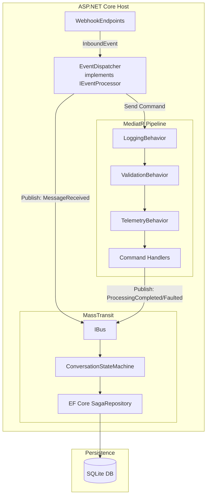

# Design Document: MediatR & MassTransit Pipeline

## Overview

This design introduces two complementary messaging frameworks into the RideClub Bot platform:

1. **MediatR** — an in-process mediator that translates inbound webhook events into strongly-typed commands/notifications and dispatches them to handlers, replacing the placeholder `LoggingEventProcessor`.
2. **MassTransit** — a message-based abstraction over transport that provides durable saga state machines for tracking multi-turn conversation lifecycle, persisted via EF Core to the existing SQLite database.

The integration point between the two is the `Event_Dispatcher`: it implements `IEventProcessor`, translates `InboundEvent` into MediatR commands, and publishes MassTransit conversation events to drive state machine transitions. Pipeline behaviors provide cross-cutting logging, validation, and telemetry without handler-level duplication.

### Design Decisions

| Decision | Rationale |
|----------|-----------|
| MediatR via Autofac integration package | Aligns with existing Autofac module composition; avoids fighting the DI container |
| MassTransit in-memory transport (dev) | Zero infrastructure for local development; production transport selectable via config |
| EF Core saga persistence in existing SQLite DB | Reuses existing persistence infrastructure; no new database required |
| Separate MediatorModule and SagaModule | Follows existing module pattern (MessagingModule, PersistenceModule, ObservabilityModule) |
| Commands in Domain project | Keeps contracts referenceable by handler projects without Bot_Host dependency |
| Open-generic pipeline behavior registration | New behaviors apply to all request types automatically |

## Architecture



### Request Flow

1. `WebhookEndpoints.HandlePostAsync` calls `IEventProcessor.ProcessAsync(inboundEvent)`
2. `EventDispatcher` publishes a `MessageReceivedEvent` to MassTransit (state machine transitions to Processing)
3. `EventDispatcher` maps `InboundEvent.Payload` to a MediatR command and calls `IMediator.Send`
4. Pipeline behaviors execute in order: Logging → Validation → Telemetry → Handler
5. Handler processes the command, returns `MessageProcessingResult`
6. Handler publishes `ProcessingCompletedEvent` or `ProcessingFaultedEvent` to MassTransit
7. State machine transitions based on the conversation event

## Components and Interfaces

### New Autofac Modules

#### MediatorModule

Registered in `Program.cs` alongside existing modules. Responsibilities:
- Register MediatR services via `MediatR.Extensions.Autofac.DependencyInjection`
- Scan `LDK.RideClub.Bot.Domain` assembly for handler implementations
- Register open-generic pipeline behaviors in execution order
- Register `EventDispatcher` as `IEventProcessor` (replacing `LoggingEventProcessor`)

```csharp
internal sealed class MediatorModule : Module
{
    protected override void Load(ContainerBuilder builder)
    {
        // Register MediatR with assembly scanning
        builder.RegisterMediatR(MediatRConfigurationExpression cfg =>
        {
            cfg.RegisterServicesFromAssemblyContaining<ProcessTextMessageCommand>();
        });

        // Pipeline behaviors in execution order (outermost first)
        builder.RegisterGeneric(typeof(LoggingBehavior<,>))
            .As(typeof(IPipelineBehavior<,>))
            .InstancePerLifetimeScope();

        builder.RegisterGeneric(typeof(ValidationBehavior<,>))
            .As(typeof(IPipelineBehavior<,>))
            .InstancePerLifetimeScope();

        builder.RegisterGeneric(typeof(TelemetryBehavior<,>))
            .As(typeof(IPipelineBehavior<,>))
            .InstancePerLifetimeScope();

        // Replace LoggingEventProcessor with EventDispatcher
        builder.RegisterType<EventDispatcher>()
            .As<IEventProcessor>()
            .InstancePerLifetimeScope();
    }
}
```

#### SagaModule

Registered in `Program.cs`. Responsibilities:
- Configure MassTransit with in-memory transport (configurable)
- Register `ConversationStateMachine` and its saga repository
- Configure EF Core saga persistence using existing `BotDbContext`
- Register MassTransit OpenTelemetry instrumentation

```csharp
internal sealed class SagaModule : Module
{
    protected override void Load(ContainerBuilder builder)
    {
        // MassTransit is registered via IServiceCollection extension
        // This module handles any Autofac-specific saga registrations
    }
}
```

MassTransit registration will use an `IServiceCollection` extension method (similar to `AddBotPersistence`):

```csharp
internal static class MassTransitServiceCollectionExtensions
{
    public static IServiceCollection AddBotMassTransit(
        this IServiceCollection services,
        IConfiguration configuration)
    {
        services.AddMassTransit(cfg =>
        {
            cfg.AddSagaStateMachine<ConversationStateMachine, ConversationSagaInstance>()
                .EntityFrameworkRepository(r =>
                {
                    r.ExistingDbContext<BotDbContext>();
                    r.UseSqlite();
                });

            cfg.UsingInMemory((context, inMemoryCfg) =>
            {
                inMemoryCfg.ConfigureEndpoints(context);
            });

            cfg.AddOpenTelemetry();
        });

        return services;
    }
}
```

### EventDispatcher

The core integration component implementing `IEventProcessor`:

```csharp
internal sealed class EventDispatcher : IEventProcessor
{
    private readonly IMediator _mediator;
    private readonly IBus _bus;
    private readonly ILogger<EventDispatcher> _logger;

    public async Task ProcessAsync(InboundEvent inboundEvent, CancellationToken ct)
    {
        // 1. Publish MessageReceived to MassTransit
        await PublishMessageReceivedAsync(inboundEvent, ct);

        // 2. Map payload to MediatR command and send
        var command = MapToCommand(inboundEvent);
        if (command is not null)
        {
            var result = await _mediator.Send(command, ct);
            // 3. Publish completion/fault event to MassTransit
            await PublishOutcomeAsync(inboundEvent, result, ct);
        }
        else
        {
            // Unknown payload type — publish notification
            await _mediator.Publish(
                new UnrecognisedEventNotification(inboundEvent), ct);
        }
    }

    private IBaseRequest? MapToCommand(InboundEvent evt) => evt.Payload switch
    {
        TextMessagePayload txt => new ProcessTextMessageCommand { ... },
        CommandPayload cmd => new ProcessBotCommandCommand { ... },
        _ => null
    };
}
```

### Pipeline Behaviors

#### LoggingBehavior

Wraps the entire pipeline. Logs request type + unique ID before execution, and type + ID + elapsed time after.

```csharp
internal sealed class LoggingBehavior<TRequest, TResponse>
    : IPipelineBehavior<TRequest, TResponse>
    where TRequest : IRequest<TResponse>
{
    public async Task<TResponse> Handle(
        TRequest request,
        RequestHandlerDelegate<TResponse> next,
        CancellationToken ct)
    {
        var requestId = Guid.NewGuid().ToString("N")[..8];
        var typeName = typeof(TRequest).Name;
        _logger.LogInformation("Handling {RequestType} [{RequestId}]", typeName, requestId);
        var sw = Stopwatch.StartNew();
        var response = await next();
        sw.Stop();
        _logger.LogInformation("Handled {RequestType} [{RequestId}] in {ElapsedMs}ms",
            typeName, requestId, sw.ElapsedMilliseconds);
        return response;
    }
}
```

#### ValidationBehavior

Resolves all `IValidator<TRequest>` instances, runs validation, throws `ValidationException` on failure.

```csharp
internal sealed class ValidationBehavior<TRequest, TResponse>
    : IPipelineBehavior<TRequest, TResponse>
    where TRequest : IRequest<TResponse>
{
    private readonly IEnumerable<IValidator<TRequest>> _validators;

    public async Task<TResponse> Handle(
        TRequest request,
        RequestHandlerDelegate<TResponse> next,
        CancellationToken ct)
    {
        if (_validators.Any())
        {
            var context = new ValidationContext<TRequest>(request);
            var results = await Task.WhenAll(
                _validators.Select(v => v.ValidateAsync(context, ct)));
            var failures = results.SelectMany(r => r.Errors)
                .Where(f => f is not null).ToList();
            if (failures.Count > 0)
                throw new ValidationException(failures);
        }
        return await next();
    }
}
```

#### TelemetryBehavior

Creates an OpenTelemetry activity span for each request, recording outcome.

```csharp
internal sealed class TelemetryBehavior<TRequest, TResponse>
    : IPipelineBehavior<TRequest, TResponse>
    where TRequest : IRequest<TResponse>
{
    private static readonly ActivitySource Source = new("RideClub.Bot.Mediator");

    public async Task<TResponse> Handle(
        TRequest request,
        RequestHandlerDelegate<TResponse> next,
        CancellationToken ct)
    {
        using var activity = Source.StartActivity(typeof(TRequest).Name);
        try
        {
            var response = await next();
            activity?.SetTag("mediatr.outcome", "success");
            return response;
        }
        catch (Exception ex)
        {
            activity?.SetTag("mediatr.outcome", "exception");
            activity?.SetTag("mediatr.exception_type", ex.GetType().Name);
            throw;
        }
    }
}
```

### Conversation State Machine

```csharp
public sealed class ConversationStateMachine
    : MassTransitStateMachine<ConversationSagaInstance>
{
    // States
    public State AwaitingInput { get; private set; } = null!;
    public State Processing { get; private set; } = null!;
    public State AwaitingConfirmation { get; private set; } = null!;
    public State Completed { get; private set; } = null!;
    public State Faulted { get; private set; } = null!;

    // Events
    public Event<MessageReceivedEvent> MessageReceived { get; private set; } = null!;
    public Event<ProcessingCompletedEvent> ProcessingCompleted { get; private set; } = null!;
    public Event<ProcessingFaultedEvent> ProcessingFaulted { get; private set; } = null!;
    public Event<ConversationTimedOutEvent> TimedOut { get; private set; } = null!;

    public ConversationStateMachine()
    {
        InstanceState(x => x.CurrentState);

        Event(() => MessageReceived, x => x.CorrelateBy(
            instance => instance.CorrelationKey,
            context => $"{context.Message.Platform}:{context.Message.SenderId}"));

        // Initial → AwaitingInput (new conversation)
        Initially(
            When(MessageReceived)
                .Then(ctx => { /* set instance fields */ })
                .TransitionTo(AwaitingInput));

        // AwaitingInput → Processing
        During(AwaitingInput,
            When(MessageReceived)
                .TransitionTo(Processing));

        // Processing → AwaitingInput or AwaitingConfirmation
        During(Processing,
            When(ProcessingCompleted)
                .IfElse(ctx => ctx.Message.RequiresConfirmation,
                    then => then.TransitionTo(AwaitingConfirmation),
                    @else => @else.TransitionTo(AwaitingInput)),
            When(ProcessingFaulted)
                .TransitionTo(Faulted));

        // AwaitingConfirmation → AwaitingInput
        During(AwaitingConfirmation,
            When(MessageReceived)
                .TransitionTo(Processing),
            When(TimedOut)
                .TransitionTo(Completed));

        // Timeout in AwaitingInput
        During(AwaitingInput,
            When(TimedOut)
                .TransitionTo(Completed));
    }
}
```

### MassTransitOptions

```csharp
internal sealed class MassTransitOptions
{
    public const string SectionName = "MassTransit";
    public required string TransportType { get; set; } // "InMemory" | "RabbitMq"
    public int ConcurrencyLimit { get; set; } = 10;
}
```

## Data Models

### MediatR Command Types (Domain Project)

```csharp
// LDK.RideClub.Bot.Domain/Commands/ProcessTextMessageCommand.cs
public sealed record ProcessTextMessageCommand : IRequest<MessageProcessingResult>
{
    public required string SenderId { get; init; }
    public required string ConversationId { get; init; }
    public required string Platform { get; init; }
    public required string MessageText { get; init; }
    public required DateTimeOffset Timestamp { get; init; }
}

// LDK.RideClub.Bot.Domain/Commands/ProcessBotCommandCommand.cs
public sealed record ProcessBotCommandCommand : IRequest<MessageProcessingResult>
{
    public required string SenderId { get; init; }
    public required string ConversationId { get; init; }
    public required string Platform { get; init; }
    public required string CommandName { get; init; }
    public IReadOnlyDictionary<string, string> Arguments { get; init; }
        = new Dictionary<string, string>();
    public required DateTimeOffset Timestamp { get; init; }
}

// LDK.RideClub.Bot.Domain/Responses/MessageProcessingResult.cs
public sealed record MessageProcessingResult
{
    public required bool Success { get; init; }
    public string? ReplyMessage { get; init; }
    public string? ErrorReason { get; init; }
}
```

### MassTransit Conversation Events (Domain Project)

```csharp
// LDK.RideClub.Bot.Domain/Events/Conversation/MessageReceivedEvent.cs
public sealed record MessageReceivedEvent
{
    public required string Platform { get; init; }
    public required string SenderId { get; init; }
    public required string ConversationId { get; init; }
    public required string EventId { get; init; }
    public required DateTimeOffset Timestamp { get; init; }
}

// LDK.RideClub.Bot.Domain/Events/Conversation/ProcessingCompletedEvent.cs
public sealed record ProcessingCompletedEvent
{
    public required string Platform { get; init; }
    public required string SenderId { get; init; }
    public required bool RequiresConfirmation { get; init; }
    public string? ReplyMessage { get; init; }
}

// LDK.RideClub.Bot.Domain/Events/Conversation/ProcessingFaultedEvent.cs
public sealed record ProcessingFaultedEvent
{
    public required string Platform { get; init; }
    public required string SenderId { get; init; }
    public required string ErrorReason { get; init; }
}

// LDK.RideClub.Bot.Domain/Events/Conversation/ConversationTimedOutEvent.cs
public sealed record ConversationTimedOutEvent
{
    public required string Platform { get; init; }
    public required string SenderId { get; init; }
    public required string Reason { get; init; }
}
```

### Saga Instance Entity (Persistence Project)

```csharp
// LDK.RideClub.Bot.Persistence/Entities/ConversationSagaInstance.cs
public sealed class ConversationSagaInstance : SagaStateMachineInstance
{
    public Guid CorrelationId { get; set; }

    /// <summary>Composite key: "{Platform}:{SenderId}"</summary>
    public required string CorrelationKey { get; set; }

    public required string CurrentState { get; set; }
    public required string Platform { get; set; }
    public required string SenderId { get; set; }
    public required string ConversationId { get; set; }

    public DateTimeOffset CreatedAt { get; set; }
    public DateTimeOffset LastModifiedAt { get; set; }

    /// <summary>Optimistic concurrency token.</summary>
    public uint RowVersion { get; set; }
}
```

### EF Core Configuration for Saga

```csharp
// LDK.RideClub.Bot.Persistence/Configuration/ConversationSagaInstanceConfiguration.cs
internal sealed class ConversationSagaInstanceConfiguration
    : IEntityTypeConfiguration<ConversationSagaInstance>
{
    public void Configure(EntityTypeBuilder<ConversationSagaInstance> builder)
    {
        builder.ToTable("ConversationSagas");
        builder.HasKey(x => x.CorrelationId);
        builder.HasIndex(x => x.CorrelationKey).IsUnique();
        builder.Property(x => x.RowVersion).IsRowVersion();
        builder.Property(x => x.CurrentState).HasMaxLength(64);
        builder.Property(x => x.CorrelationKey).HasMaxLength(256);
        builder.Property(x => x.Platform).HasMaxLength(64);
        builder.Property(x => x.SenderId).HasMaxLength(128);
        builder.Property(x => x.ConversationId).HasMaxLength(128);
    }
}
```

### MediatR Notification for Unrecognised Events

```csharp
// LDK.RideClub.Bot.Domain/Events/UnrecognisedEventNotification.cs
public sealed record UnrecognisedEventNotification(InboundEvent Event) : INotification;
```


## Correctness Properties

*A property is a characteristic or behavior that should hold true across all valid executions of a system — essentially, a formal statement about what the system should do. Properties serve as the bridge between human-readable specifications and machine-verifiable correctness guarantees.*

### Property 1: Dispatch Exclusivity

*For any* valid `InboundEvent`, calling `EventDispatcher.ProcessAsync` SHALL result in exactly one of: (a) a single `IMediator.Send` call if the payload maps to a known command type, or (b) a single `IMediator.Publish` call if the payload type is unrecognised — never both, never neither.

**Validates: Requirements 2.3, 2.4, 10.5**

### Property 2: Command Field Mapping Preservation

*For any* valid `InboundEvent` with a known `EventPayload` subtype, the MediatR command produced by the `EventDispatcher` SHALL carry the same `SenderId`, `ConversationId`, `Platform`, and `Timestamp` values as the source `InboundEvent`, and payload-specific fields (e.g., `MessageText` from `TextMessagePayload.Text`, `CommandName` from `CommandPayload.CommandName`) SHALL be preserved without transformation.

**Validates: Requirements 2.2, 4.1, 4.2**

### Property 3: Exception Transparency

*For any* exception thrown by `IMediator.Send` during command dispatch, the `EventDispatcher.ProcessAsync` method SHALL propagate that exact exception to the caller without catching, wrapping, or swallowing it.

**Validates: Requirements 2.5**

### Property 4: Validation Short-Circuit

*For any* MediatR request where at least one registered `IValidator<TRequest>` returns validation failures, the `ValidationBehavior` SHALL throw a `ValidationException` containing all failures from all validators, and the downstream handler SHALL NOT be invoked.

**Validates: Requirements 3.2**

### Property 5: Saga Correlation Identity

*For any* two `MessageReceivedEvent` messages, they SHALL correlate to the same `ConversationSagaInstance` if and only if they share the same `Platform` and `SenderId` combination. Different `Platform`+`SenderId` pairs SHALL always correlate to distinct saga instances.

**Validates: Requirements 6.2**

### Property 6: New Conversation Creation

*For any* `MessageReceivedEvent` where no `ConversationSagaInstance` exists for the correlation key, the state machine SHALL create a new instance in the `AwaitingInput` state with the correct `Platform`, `SenderId`, and `ConversationId` fields populated.

**Validates: Requirements 6.3**

### Property 7: AwaitingInput to Processing Transition

*For any* `ConversationSagaInstance` in the `AwaitingInput` state, receiving a `MessageReceivedEvent` with a matching correlation key SHALL transition the instance to the `Processing` state.

**Validates: Requirements 6.4**

### Property 8: Conditional Completion Routing

*For any* `ConversationSagaInstance` in the `Processing` state receiving a `ProcessingCompletedEvent`, the instance SHALL transition to `AwaitingConfirmation` if `RequiresConfirmation` is true, or to `AwaitingInput` if `RequiresConfirmation` is false.

**Validates: Requirements 6.5**

### Property 9: Timeout Terminates Conversation

*For any* `ConversationSagaInstance` in the `AwaitingInput` or `AwaitingConfirmation` state, receiving a `ConversationTimedOutEvent` SHALL transition the instance to the `Completed` state.

**Validates: Requirements 6.6**

### Property 10: Undefined Transitions Are Ignored

*For any* `ConversationSagaInstance` in a given state, receiving a `Conversation_Event` that has no defined transition for that state SHALL leave the instance in its current state unchanged.

**Validates: Requirements 6.7**

### Property 11: Optimistic Concurrency Prevents Lost Updates

*For any* two concurrent state transitions targeting the same `ConversationSagaInstance`, exactly one SHALL succeed and the other SHALL fail with a concurrency exception, ensuring no state transition is silently lost.

**Validates: Requirements 7.6**

### Property 12: Outcome Event Publication

*For any* command processing result, the handler SHALL publish exactly one MassTransit conversation event: a `ProcessingCompletedEvent` if processing succeeded, or a `ProcessingFaultedEvent` if processing failed due to a domain error — carrying the correct correlation key (`Platform`+`SenderId`) and outcome data.

**Validates: Requirements 8.1, 8.2**

### Property 13: Event Ordering — MessageReceived Before Command Dispatch

*For any* valid `InboundEvent` processed by the `EventDispatcher`, the `MessageReceivedEvent` SHALL be published to the MassTransit bus strictly before `IMediator.Send` is called, ensuring the state machine transitions to `Processing` before handler execution begins.

**Validates: Requirements 8.3**

## Error Handling

### MediatR Pipeline Errors

| Error Scenario | Handling Strategy | Requirement |
|---|---|---|
| No handler registered for command type | MediatR throws `InvalidOperationException`; propagates to webhook pipeline which returns 500 | 1.4 |
| Validation failure in pipeline | `ValidationBehavior` throws `ValidationException`; propagates to webhook pipeline | 3.2 |
| Handler throws unhandled exception | Exception propagates through pipeline behaviors (telemetry records it, logging logs it) to webhook pipeline | 2.5 |
| Unknown payload type | `EventDispatcher` publishes `UnrecognisedEventNotification` and logs warning; no exception thrown | 2.4 |

### MassTransit / Saga Errors

| Error Scenario | Handling Strategy | Requirement |
|---|---|---|
| Bus unavailable during publish | Log warning via Serilog; continue processing without blocking webhook response | 8.5 |
| Database error during saga persistence | State machine transitions to `Faulted` state; error logged with correlation key | 7.5 |
| Optimistic concurrency conflict | MassTransit retries the message consumption; EF Core throws `DbUpdateConcurrencyException` | 7.6 |
| Invalid transport configuration at startup | Host fails to start; error logged identifying transport type and failure reason | 5.6 |
| Undefined state transition | State machine ignores the event; warning logged with event type, current state, correlation key | 6.7 |

### Resilience Principles

1. **Webhook response is never blocked by saga failures** — MassTransit publish failures are logged but do not prevent the HTTP 200 response
2. **Exceptions from command handlers propagate cleanly** — no swallowing; the existing `GlobalExceptionMiddleware` handles HTTP response generation
3. **Saga state is always consistent** — optimistic concurrency + transactional persistence ensures no lost updates
4. **Observability on all error paths** — every error scenario produces structured logs with trace correlation and/or telemetry spans

## Testing Strategy

### Unit Tests

- **Command Handlers**: Test each handler in isolation with mocked `IBus` and domain dependencies. Verify correct `MessageProcessingResult` for various inputs and that appropriate conversation events are published.
- **EventDispatcher**: Test with mocked `IMediator` and `IBus`. Verify mapping logic, dispatch exclusivity, ordering, and exception propagation.
- **Pipeline Behaviors**: Test each behavior in isolation with a mock `RequestHandlerDelegate`. Verify logging output, validation short-circuit, and telemetry span creation.
- **Validators**: Test FluentValidation validators with valid and invalid command instances.

### Property-Based Tests (FsCheck)

Property-based testing is appropriate for this feature because:
- The `EventDispatcher` mapping logic is a pure function over the `EventPayload` type hierarchy
- State machine transitions are deterministic functions of (current state, event) → next state
- Correlation logic is a pure function of (platform, senderId) → correlation key

**Configuration:**
- Library: **FsCheck.Xunit** (already in `Directory.Packages.props`)
- Minimum iterations: 100 per property
- Tag format: `Feature: mediatr-masstransit-pipeline, Property {N}: {description}`

**Properties to implement:**
1. Dispatch exclusivity (Property 1)
2. Command field mapping preservation (Property 2)
3. Exception transparency (Property 3)
4. Validation short-circuit (Property 4)
5. State machine transitions (Properties 6–10, using MassTransit InMemoryTestHarness)
6. Outcome event publication (Property 12)
7. Event ordering (Property 13)

### Integration Tests

- **Full pipeline test**: WebApplicationFactory with MassTransit in test harness mode. POST a webhook payload → verify command handler executes → verify saga state transitions.
- **Saga persistence test**: Verify saga instances survive across scopes (simulating process restart).
- **Observability correlation test**: Verify trace spans are correlated from webhook through mediator to saga.

### Test Infrastructure

- All tests run via `dotnet test` without network access, Docker, or external brokers
- MassTransit uses `InMemoryTestHarness` for saga tests
- EF Core uses `InMemory` provider for unit tests, SQLite for integration tests
- `BotWebApplicationFactory` extended to register MassTransit test harness and configure MediatorModule/SagaModule
