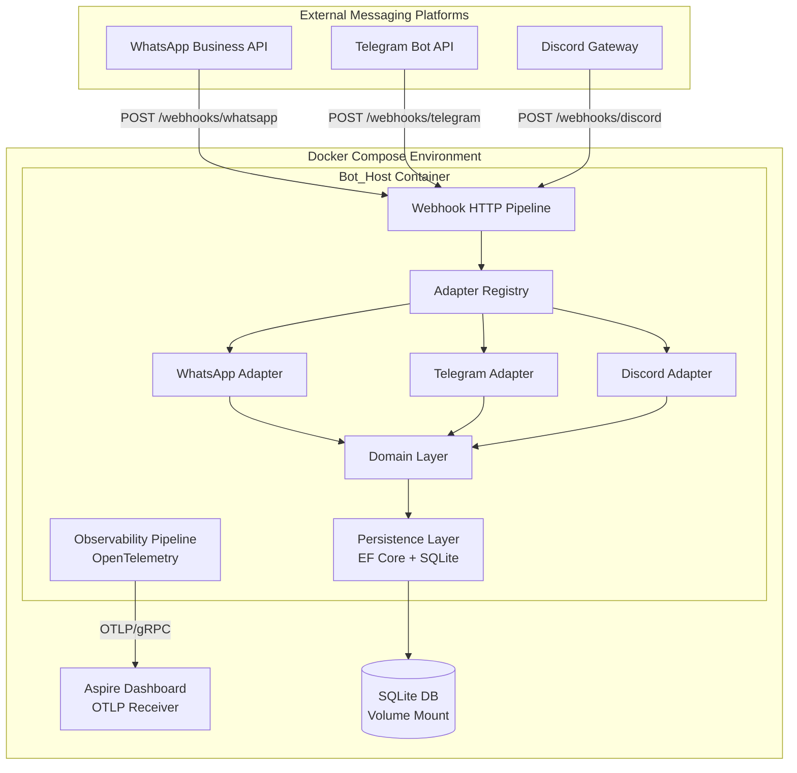
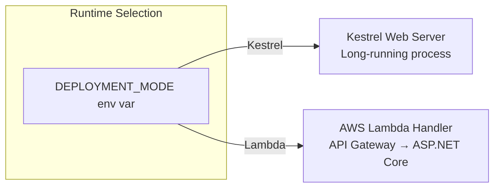
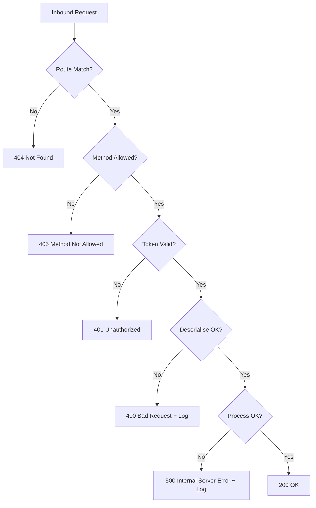

# Design Document: RideClub Bot Platform

## Overview

This design defines the foundational platform architecture for the RideClub Bot — a multi-platform messaging bot for organising motorbike club ride outs. The platform establishes the application skeleton, dependency injection, webhook HTTP pipeline, data persistence, containerisation, observability, and deployment infrastructure. Feature-specific bot logic (ride scheduling, RSVP, etc.) is out of scope and will be layered on top of this foundation.

The platform is built on ASP.NET Core 8 (LTS) using the Microsoft Generic Host, extended with Autofac for modular dependency injection. It exposes webhook endpoints for receiving events from messaging platforms (WhatsApp, Telegram, Discord), persists state via Entity Framework Core with SQLite for local development, and exports telemetry to the Aspire Dashboard via OpenTelemetry OTLP. The application is containerised with Docker and deployable as either a long-running Kestrel service or an AWS Lambda function.

### Key Design Decisions

| Decision | Choice | Rationale |
|----------|--------|-----------|
| Target Framework | .NET 8 (LTS) | Long-term support, stable ecosystem, required by Req 1.1 |
| DI Container | Autofac (via `Autofac.Extensions.DependencyInjection`) | Module-based registration, keyed services for adapter resolution, required by Req 1.3 |
| ORM | Entity Framework Core 8 + SQLite | Familiar, migration tooling, zero-infrastructure local dev, required by Req 9 |
| Observability | OpenTelemetry .NET SDK + OTLP Exporter | Vendor-neutral, first-class .NET support, Aspire Dashboard compatible |
| Testing | xUnit + NSubstitute + `WebApplicationFactory` | Standard .NET testing stack, in-process integration tests |
| Lambda Hosting | `Amazon.Lambda.AspNetCoreServer.Hosting` | Single codebase for both Kestrel and Lambda, runtime-selectable |
| Package Management | Central Package Management (`Directory.Packages.props`) | Single source of truth for versions across monorepo |

## Architecture

### High-Level Architecture



### Deployment Modes



### Solution Structure

```
rideclub-bot/
├── Directory.Build.props
├── Directory.Packages.props
├── .editorconfig
├── RideClub.Bot.slnx
├── docker-compose.yml
├── Dockerfile
├── src/
│   ├── RideClub.Bot/                    # ASP.NET Core host application
│   │   ├── Program.cs
│   │   ├── appsettings.json
│   │   ├── Configuration/              # Options models
│   │   ├── Middleware/                  # HTTP pipeline middleware
│   │   └── Modules/                    # Autofac modules
│   ├── RideClub.Bot.Abstractions/      # Interfaces and contracts
│   │   ├── Messaging/
│   │   └── Persistence/
│   ├── RideClub.Bot.Domain/            # Domain models
│   │   ├── Events/
│   │   ├── Commands/
│   │   └── Responses/
│   ├── RideClub.Bot.Adapters.WhatsApp/ # WhatsApp adapter
│   │   ├── DTOs/
│   │   └── WhatsAppMessagingAdapter.cs
│   ├── RideClub.Bot.Persistence/       # EF Core persistence
│   │   ├── BotDbContext.cs
│   │   └── Migrations/
│   └── RideClub.Bot.Observability/     # OTel configuration
│       └── ObservabilityExtensions.cs
└── tests/
    └── RideClub.Bot.Tests/             # xUnit test project
        ├── Integration/
        └── Unit/
```

## Components and Interfaces

### Core Interfaces

#### IMessagingAdapter

The central abstraction for platform-specific integrations. Each messaging platform implements this interface.

```csharp
namespace RideClub.Bot.Abstractions.Messaging;

public interface IMessagingAdapter
{
    /// <summary>
    /// Unique identifier for the messaging platform (e.g., "whatsapp", "telegram", "discord").
    /// Used for routing webhook requests to the correct adapter.
    /// </summary>
    string PlatformId { get; }

    /// <summary>
    /// Verifies the webhook signature/token from the platform.
    /// </summary>
    Task<bool> VerifyWebhookAsync(HttpRequest request, CancellationToken ct = default);

    /// <summary>
    /// Handles platform verification challenges (e.g., GET requests with challenge tokens).
    /// </summary>
    Task<IResult> HandleVerificationChallengeAsync(HttpRequest request, CancellationToken ct = default);

    /// <summary>
    /// Deserialises the inbound platform payload into a domain event.
    /// </summary>
    Task<InboundEvent> DeserialiseEventAsync(HttpRequest request, CancellationToken ct = default);

    /// <summary>
    /// Sends an outbound message to the platform.
    /// </summary>
    Task<SendResult> SendMessageAsync(OutboundMessage message, CancellationToken ct = default);
}
```

#### IAdapterRegistry

Resolves the correct adapter based on the platform identifier from the URL path.

```csharp
namespace RideClub.Bot.Abstractions.Messaging;

public interface IAdapterRegistry
{
    IMessagingAdapter? GetAdapter(string platformId);
    IEnumerable<string> RegisteredPlatforms { get; }
}
```

#### IEventProcessor

Processes domain events after they have been deserialised from platform-specific payloads.

```csharp
namespace RideClub.Bot.Abstractions.Messaging;

public interface IEventProcessor
{
    Task ProcessAsync(InboundEvent inboundEvent, CancellationToken ct = default);
}
```

### Webhook HTTP Pipeline

The webhook pipeline uses ASP.NET Core Minimal APIs with a single route group:

```csharp
// Webhook route registration
app.MapGroup("/webhooks/{platformId}")
    .MapPost("/", WebhookHandler.HandlePost)
    .MapGet("/", WebhookHandler.HandleVerification)
    .WithName("Webhooks");
```

The `WebhookHandler` static class:
1. Extracts `platformId` from the route
2. Resolves the adapter via `IAdapterRegistry`
3. Returns 404 if no adapter matches
4. Verifies the webhook signature → 401 if invalid
5. Deserialises the event and dispatches to `IEventProcessor`
6. Returns 200 OK

Unhandled exceptions are caught by global exception-handling middleware that logs via the observability pipeline and returns 500.

### Autofac Module Structure

```csharp
// Composition root modules
public class MessagingModule : Module
{
    protected override void Load(ContainerBuilder builder)
    {
        // Register all IMessagingAdapter implementations as keyed by PlatformId
        builder.RegisterAssemblyTypes(typeof(MessagingModule).Assembly)
            .Where(t => t.IsAssignableTo<IMessagingAdapter>())
            .AsImplementedInterfaces()
            .InstancePerLifetimeScope();

        builder.RegisterType<AdapterRegistry>()
            .As<IAdapterRegistry>()
            .SingleInstance();
    }
}

public class PersistenceModule : Module { /* EF Core registrations */ }
public class ObservabilityModule : Module { /* OTel registrations */ }
```

### Configuration Options Models

```csharp
public class WebhookOptions
{
    public const string SectionName = "Webhooks";

    [Required]
    public string BasePath { get; set; } = "/webhooks";
}

public class WhatsAppOptions
{
    public const string SectionName = "Adapters:WhatsApp";

    [Required] public string VerifyToken { get; set; } = string.Empty;
    [Required] public string AccessToken { get; set; } = string.Empty;
    [Required] public string PhoneNumberId { get; set; } = string.Empty;
}

public class PersistenceOptions
{
    public const string SectionName = "Persistence";

    [Required] public string SqliteConnectionString { get; set; } = string.Empty;
}

public class OtlpOptions
{
    public const string SectionName = "Otlp";

    [Required] public string Endpoint { get; set; } = string.Empty;
}

public class DeploymentOptions
{
    public const string SectionName = "Deployment";

    [Required]
    [RegularExpression("^(Kestrel|Lambda)$")]
    public string Mode { get; set; } = string.Empty;
}
```

### Deployment Mode Selection

```csharp
// Program.cs entry point
var deploymentMode = Environment.GetEnvironmentVariable("DEPLOYMENT_MODE");

if (string.IsNullOrEmpty(deploymentMode) ||
    (deploymentMode != "Kestrel" && deploymentMode != "Lambda"))
{
    Console.Error.WriteLine(
        "DEPLOYMENT_MODE environment variable must be set to 'Kestrel' or 'Lambda'.");
    Environment.Exit(1);
}

var builder = WebApplication.CreateBuilder(args);

// Common service registration...
builder.Host.UseServiceProviderFactory(new AutofacServiceProviderFactory());
builder.Host.ConfigureContainer<ContainerBuilder>(containerBuilder =>
{
    containerBuilder.RegisterModule<MessagingModule>();
    containerBuilder.RegisterModule<PersistenceModule>();
    containerBuilder.RegisterModule<ObservabilityModule>();
});

if (deploymentMode == "Lambda")
{
    builder.Services.AddAWSLambdaHosting(LambdaEventSource.HttpApi);
}

var app = builder.Build();
// Middleware and endpoint registration...
app.Run();
```

## Data Models

### Domain Models

```csharp
namespace RideClub.Bot.Domain.Events;

/// <summary>
/// Represents an inbound event from any messaging platform,
/// normalised into a platform-agnostic shape.
/// </summary>
public sealed record InboundEvent
{
    public required string EventId { get; init; }
    public required string Platform { get; init; }
    public required string SenderId { get; init; }
    public required string ConversationId { get; init; }
    public required DateTimeOffset Timestamp { get; init; }
    public required EventPayload Payload { get; init; }
}

public abstract record EventPayload;

public sealed record TextMessagePayload : EventPayload
{
    public required string Text { get; init; }
}

public sealed record CommandPayload : EventPayload
{
    public required string CommandName { get; init; }
    public IReadOnlyDictionary<string, string> Arguments { get; init; }
        = new Dictionary<string, string>();
}
```

```csharp
namespace RideClub.Bot.Domain.Commands;

public sealed record OutboundMessage
{
    public required string Platform { get; init; }
    public required string RecipientId { get; init; }
    public required string ConversationId { get; init; }
    public required MessageContent Content { get; init; }
}

public abstract record MessageContent;

public sealed record TextContent : MessageContent
{
    public required string Text { get; init; }
}
```

```csharp
namespace RideClub.Bot.Domain.Responses;

public sealed record SendResult
{
    public bool Success { get; init; }
    public string? ErrorMessage { get; init; }
    public string? PlatformMessageId { get; init; }
}
```

### Platform DTOs (WhatsApp Example)

```csharp
namespace RideClub.Bot.Adapters.WhatsApp.DTOs;

/// <summary>
/// Represents the top-level webhook payload from WhatsApp Business API.
/// Contains no domain logic — pure serialization shape.
/// </summary>
public sealed class WhatsAppWebhookPayload
{
    [JsonPropertyName("object")]
    public string Object { get; set; } = string.Empty;

    [JsonPropertyName("entry")]
    public List<WhatsAppEntry> Entry { get; set; } = new();
}

public sealed class WhatsAppEntry
{
    [JsonPropertyName("id")]
    public string Id { get; set; } = string.Empty;

    [JsonPropertyName("changes")]
    public List<WhatsAppChange> Changes { get; set; } = new();
}

public sealed class WhatsAppChange
{
    [JsonPropertyName("value")]
    public WhatsAppValue Value { get; set; } = new();

    [JsonPropertyName("field")]
    public string Field { get; set; } = string.Empty;
}

public sealed class WhatsAppValue
{
    [JsonPropertyName("messaging_product")]
    public string MessagingProduct { get; set; } = string.Empty;

    [JsonPropertyName("messages")]
    public List<WhatsAppMessage>? Messages { get; set; }
}

public sealed class WhatsAppMessage
{
    [JsonPropertyName("from")]
    public string From { get; set; } = string.Empty;

    [JsonPropertyName("id")]
    public string Id { get; set; } = string.Empty;

    [JsonPropertyName("timestamp")]
    public string Timestamp { get; set; } = string.Empty;

    [JsonPropertyName("type")]
    public string Type { get; set; } = string.Empty;

    [JsonPropertyName("text")]
    public WhatsAppTextBody? Text { get; set; }
}

public sealed class WhatsAppTextBody
{
    [JsonPropertyName("body")]
    public string Body { get; set; } = string.Empty;
}
```

### EF Core Entity Model

```csharp
namespace RideClub.Bot.Persistence;

public class BotDbContext : DbContext
{
    public BotDbContext(DbContextOptions<BotDbContext> options) : base(options) { }

    public DbSet<MessageLog> MessageLogs => Set<MessageLog>();
}

public sealed class MessageLog
{
    public long Id { get; set; }
    public required string Platform { get; set; }
    public required string EventId { get; set; }
    public required string SenderId { get; set; }
    public required string ConversationId { get; set; }
    public required DateTimeOffset ReceivedAt { get; set; }
    public required string PayloadType { get; set; }
    public string? RawPayload { get; set; }
}
```


## Correctness Properties

*A property is a characteristic or behavior that should hold true across all valid executions of a system — essentially, a formal statement about what the system should do. Properties serve as the bridge between human-readable specifications and machine-verifiable correctness guarantees.*

### Property 1: Constructor Dependency Limit

*For any* class in the application assemblies (excluding the composition root), the constructor SHALL have no more than 5 parameters (not counting a single cross-cutting concern like ILogger<T>).

**Validates: Requirements 4.1**

### Property 2: Dependencies on Abstractions

*For any* class in the application assemblies, constructor parameters representing logging, persistence, or messaging dependencies SHALL be interface types rather than concrete implementations.

**Validates: Requirements 4.2**

### Property 3: No Service Locator Pattern

*For any* class in the application assemblies (excluding the composition root), there SHALL be no constructor parameter, field, or property of type `IServiceProvider`, and no call to `GetService` or `GetRequiredService` within the class body.

**Validates: Requirements 4.3**

### Property 4: Interface Segregation Limit

*For any* interface defined in the application assemblies, the interface SHALL declare no more than 5 methods.

**Validates: Requirements 4.5**

### Property 5: Options Validation Rejects Invalid Configuration

*For any* Options_Model class with invalid property values (missing required fields, out-of-range values, or malformed strings), startup validation SHALL reject the configuration and produce an error message that contains both the Options_Model class name and the name of each property that failed validation.

**Validates: Requirements 5.2, 5.3**

### Property 6: DTO-to-Domain Mapping Purity

*For any* valid Platform_DTO instance, mapping it to a Domain_Model SHALL produce an object whose type hierarchy contains no references to platform-specific SDK types, serialization attributes (e.g., `JsonPropertyName`), or external API identifiers.

**Validates: Requirements 6.3**

### Property 7: No Raw JSON in Component Interfaces

*For any* public method in the application assemblies (excluding the webhook endpoint boundary), parameters and return types SHALL not be `string` representing JSON, `Dictionary<string, object>`, `dynamic`, or `JsonElement` for structured domain data.

**Validates: Requirements 6.4**

### Property 8: Invalid DTO Rejection

*For any* Platform_DTO with missing required fields or an unrecognised payload structure, the Messaging_Adapter's deserialise method SHALL return an error indication that identifies the specific mapping failure reason rather than throwing an unhandled exception or returning a partially-populated Domain_Model.

**Validates: Requirements 6.5**

### Property 9: Adapter Resolution by Platform Identifier

*For any* registered Messaging_Adapter with a declared platform identifier, an HTTP POST to `/webhooks/{platformId}` SHALL route the request to the adapter whose `PlatformId` property matches the path segment, and the adapter SHALL receive the full request for processing.

**Validates: Requirements 7.2, 8.3**

### Property 10: Invalid Verification Token Returns 401

*For any* HTTP POST request to a valid webhook endpoint where the verification token is missing, empty, or does not match the expected value, the Bot_Host SHALL respond with HTTP 401 Unauthorized and SHALL NOT invoke the adapter's deserialise or process methods.

**Validates: Requirements 7.3**

### Property 11: Adapter Exception Returns 500

*For any* exception thrown by a Messaging_Adapter during request processing, the Bot_Host SHALL respond with HTTP 500 Internal Server Error and SHALL log the exception details via the Observability_Pipeline.

**Validates: Requirements 7.5**

### Property 12: Unsupported HTTP Method Returns 405

*For any* HTTP method other than POST or GET sent to a webhook endpoint path, the Bot_Host SHALL respond with HTTP 405 Method Not Allowed.

**Validates: Requirements 7.7**

### Property 13: Unmatched Platform Returns 404

*For any* request path segment under the webhook base path that does not match any registered Messaging_Adapter's platform identifier, the Bot_Host SHALL respond with HTTP 404 Not Found.

**Validates: Requirements 7.8, 8.5**

### Property 14: Adapter Span Attributes

*For any* Messaging_Adapter processing an inbound event, the Observability_Pipeline SHALL create a child span that includes a `messaging.platform` attribute matching the adapter's platform identifier and a `messaging.operation` attribute describing the action performed.

**Validates: Requirements 11.4**

### Property 15: Invalid Deployment Mode Fails Fast

*For any* value of the `DEPLOYMENT_MODE` environment variable that is not exactly "Kestrel" or "Lambda" (including null, empty, or any other string), the Bot_Host SHALL terminate at startup with an error message listing the valid deployment mode options.

**Validates: Requirements 13.4**

## Error Handling

### Error Handling Strategy

The platform uses a layered error handling approach:



### Error Categories

| Category | HTTP Status | Logging Level | Recovery |
|----------|-------------|---------------|----------|
| Unknown route | 404 | Warning | None needed |
| Method not allowed | 405 | Warning | None needed |
| Auth failure | 401 | Warning | None needed |
| DTO mapping failure | 400 | Warning | Log payload shape for debugging |
| Adapter processing error | 500 | Error | Log full exception, continue serving |
| Configuration validation | N/A (startup) | Critical | Fail fast, fix config |
| Migration failure | N/A (startup) | Critical | Fail fast, fix migration |
| OTLP export failure | N/A | Warning | Continue without telemetry export |

### Startup Validation Failures

The platform validates eagerly at startup:

1. **Deployment mode** — checked before host build; invalid → `Environment.Exit(1)`
2. **Configuration sources** — missing/malformed `appsettings.json` → host builder throws, logged as Critical
3. **Options validation** — `ValidateOnStart()` for all Options_Model classes; failure → `OptionsValidationException` with class + property details
4. **DI resolution** — Autofac validates the container graph; unresolvable → startup exception
5. **Database migration** (dev only) — `Database.Migrate()` failure → startup exception with migration name

### Global Exception Middleware

```csharp
public class GlobalExceptionMiddleware
{
    private readonly RequestDelegate _next;
    private readonly ILogger<GlobalExceptionMiddleware> _logger;

    public async Task InvokeAsync(HttpContext context)
    {
        try
        {
            await _next(context);
        }
        catch (Exception ex)
        {
            _logger.LogError(ex, "Unhandled exception processing {Method} {Path}",
                context.Request.Method, context.Request.Path);

            context.Response.StatusCode = StatusCodes.Status500InternalServerError;
            await context.Response.WriteAsJsonAsync(new { error = "Internal server error" });
        }
    }
}
```

### DTO Mapping Errors

Mapping failures are represented as a result type rather than exceptions:

```csharp
public abstract record MappingResult<T>;
public sealed record MappingSuccess<T>(T Value) : MappingResult<T>;
public sealed record MappingFailure<T>(string Reason) : MappingResult<T>;
```

This allows the webhook handler to distinguish between "adapter threw unexpectedly" (500) and "payload was malformed" (400) without relying on exception control flow.

## Testing Strategy

### Testing Approach

The platform uses a dual testing approach combining unit tests and property-based tests:

- **Unit tests** (xUnit + NSubstitute): Verify specific examples, edge cases, integration points, and error conditions
- **Property-based tests** (FsCheck.xUnit): Verify universal properties across generated inputs with minimum 100 iterations per property
- **Integration tests** (WebApplicationFactory): Verify the full HTTP pipeline with in-memory dependencies

### Property-Based Testing Configuration

- **Library**: [FsCheck.Xunit](https://github.com/fscheck/FsCheck) — mature PBT library for .NET with xUnit integration
- **Minimum iterations**: 100 per property test
- **Tag format**: `// Feature: rideclub-bot-platform, Property {number}: {property_text}`

### Architectural Property Tests (Properties 1–4, 7)

These properties use reflection to scan application assemblies and verify structural constraints hold universally. They run as standard xUnit tests that enumerate types and assert constraints.

```csharp
// Example: Property 4 — Interface Segregation
[Property(MaxTest = 100)]
public Property InterfaceMethodCountLimit()
{
    var interfaces = GetApplicationInterfaces();
    return interfaces.All(i => i.GetMethods().Length <= 5)
        .ToProperty();
}
```

### Webhook Pipeline Property Tests (Properties 9–13)

These properties use `WebApplicationFactory` with mock adapters to verify HTTP pipeline behavior across generated inputs:

- Generate random platform IDs, tokens, HTTP methods, and request bodies
- Register test adapters dynamically
- Assert correct HTTP status codes and adapter invocations

### DTO Mapping Property Tests (Properties 6, 8)

These properties generate random Platform_DTO instances (both valid and invalid) and verify:
- Valid DTOs map to Domain_Models free of platform types
- Invalid DTOs produce `MappingFailure` with descriptive reasons

### Configuration Property Tests (Property 5)

Generate random invalid option values for each Options_Model and verify:
- Startup validation rejects the configuration
- Error message contains class name and failed property names

### Test Project Structure

```
tests/
└── RideClub.Bot.Tests/
    ├── Integration/
    │   ├── HealthCheckTests.cs          # Smoke test (Req 12.5)
    │   ├── WebhookPipelineTests.cs      # Properties 9-13
    │   └── StartupValidationTests.cs    # Property 5
    ├── Unit/
    │   ├── AdapterRegistryTests.cs      # Property 9
    │   ├── DtoMappingTests.cs           # Properties 6, 8
    │   └── WhatsAppAdapterTests.cs      # Adapter-specific unit tests
    ├── Architecture/
    │   ├── DependencyTests.cs           # Properties 1-4
    │   └── InterfaceSegregationTests.cs # Property 4, 7
    └── Properties/
        ├── DeploymentModePropertyTests.cs  # Property 15
        ├── WebhookRoutingPropertyTests.cs  # Properties 9-13
        ├── MappingPropertyTests.cs         # Properties 6, 8
        └── ObservabilityPropertyTests.cs   # Property 14
```

### Key NuGet Packages for Testing

| Package | Purpose |
|---------|---------|
| `xunit` | Test framework |
| `xunit.runner.visualstudio` | Test discovery |
| `NSubstitute` | Mocking |
| `FsCheck.Xunit` | Property-based testing |
| `Microsoft.AspNetCore.Mvc.Testing` | WebApplicationFactory |
| `Microsoft.EntityFrameworkCore.InMemory` | In-memory EF Core provider for tests |
| `FluentAssertions` | Readable assertions |

### Test Isolation

- **No external services required**: SQLite replaced by EF Core InMemory provider, OTLP export disabled, messaging platform APIs mocked via NSubstitute
- **Parallel-safe**: Each test creates its own `WebApplicationFactory` instance with isolated DI container
- **Deterministic**: FsCheck tests use a fixed seed for reproducibility in CI
